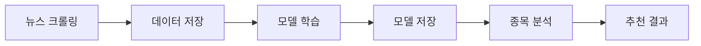

# BERT 기반 주식 뉴스 분석 통합 프로그램 - 사용 설명서

## 📋 목차

1. [프로그램 개요](#프로그램-개요)
2. [시스템 요구사항](#시스템-요구사항)
3. [설치 방법](#설치-방법)
4. [프로그램 구조](#프로그램-구조)
5. [사용 방법](#사용-방법)
6. [주요 기능 상세](#주요-기능-상세)
7. [설정 및 커스터마이징](#설정-및-커스터마이징)
8. [문제 해결](#문제-해결)
9. [예제 시나리오](#예제-시나리오)

---

## 프로그램 개요

### 목적
한국 주식 시장(코스피, 코스닥)의 뉴스를 BERT 딥러닝 모델로 분석하여 급등/급락 가능성이 있는 종목을 추천하는 통합 시스템입니다.

### 주요 기능
1. **뉴스 크롤링**: 구글 뉴스에서 특정 종목의 뉴스 자동 수집
2. **모델 학습**: BERT 모델을 활용한 감성 분석 학습
3. **종목 추천**: 학습된 모델로 최근 뉴스 분석 및 종목 추천

### 기술 스택
- **딥러닝**: TensorFlow, TensorFlow Hub (BERT)
- **데이터 처리**: Pandas, NumPy
- **웹 크롤링**: BeautifulSoup4, Requests
- **언어**: Python 3.7+

---

## 시스템 요구사항

### 하드웨어
- **최소**: CPU 4코어, RAM 8GB
- **권장**: CPU 8코어, RAM 16GB, GPU (NVIDIA CUDA 지원)

### 소프트웨어
- **운영체제**: Windows 10/11, macOS, Linux
- **Python**: 3.7 이상 (3.8~3.10 권장)
- **인터넷 연결**: 필수 (뉴스 크롤링 및 모델 다운로드)

---

## 설치 방법

### 1. 필수 패키지 설치

```bash
# 가상환경 생성 (권장)
python -m venv venv
source venv/bin/activate  # Linux/Mac
# 또는
venv\Scripts\activate  # Windows

# 패키지 설치
pip install tensorflow==2.12.0
pip install tensorflow-hub
pip install tensorflow-text
pip install tf-models-official
pip install pandas
pip install numpy
pip install beautifulsoup4
pip install lxml
pip install requests
pip install scikit-learn
pip install matplotlib
```

### 2. 프로그램 파일 준비

```bash
# 프로그램 파일 복사
stock_news_analyzer.py

# 필수 CSV 파일 준비
buy_list.csv        # 관심 종목 리스트
코스피200.csv       # 코스피 200 종목
코스닥150.csv       # 코스닥 150 종목
```

### 3. 디렉토리 구조

```
project/
├── stock_news_analyzer.py  # 통합 프로그램
├── buy_list.csv             # 관심 종목
├── 코스피200.csv
├── 코스닥150.csv
├── 급등락뉴스.csv            # 크롤링된 뉴스 (자동 생성)
├── model_weights.h5         # 학습된 모델 (자동 생성)
├── 임의기간상승.csv          # 추천 결과 (자동 생성)
└── training_history.png     # 학습 곡선 (자동 생성)
```

---

## 프로그램 구조

### 클래스 구성

```
StockNewsAnalyzer (메인)
├── NewsCrawler          # 뉴스 크롤링
├── BERTModel            # BERT 모델 관리
└── DataManager          # 데이터 처리

Utilities
├── Config               # 전역 설정
└── NewsUtils            # 유틸리티 함수
```

### 워크플로우



---

## 사용 방법

### 기본 명령어 구조

```bash
python stock_news_analyzer.py [명령] [옵션]
```

### 1. 뉴스 크롤링

#### 기본 사용법
```bash
python stock_news_analyzer.py crawl \
  --start 2026 1 15 \
  --end 2026 1 15 \
  --file buy_list.csv \
  --threshold 10
```

#### 옵션 설명
- `--start Y M D`: 검색 시작 날짜 (년 월 일)
- `--end Y M D`: 검색 종료 날짜 (년 월 일)
- `--file`: 종목 리스트 CSV 파일
- `--threshold`: 등락률 임계값
  - 양수: 상승 종목 (예: 10 → 10% 이상 상승)
  - 음수: 하락 종목 (예: -5 → 5% 이상 하락)
- `--output`: 저장 파일명 (기본: 급등락뉴스.csv)

#### 예시

**10% 이상 상승 종목 뉴스 수집**
```bash
python stock_news_analyzer.py crawl \
  --start 2026 1 15 \
  --end 2026 1 15 \
  --file buy_list.csv \
  --threshold 10 \
  --output 상승종목뉴스.csv
```

**5% 이상 하락 종목 뉴스 수집**
```bash
python stock_news_analyzer.py crawl \
  --start 2026 1 10 \
  --end 2026 1 10 \
  --file 코스피200.csv \
  --threshold -5 \
  --output 하락종목뉴스.csv
```

### 2. 모델 학습

#### 기본 사용법
```bash
python stock_news_analyzer.py train \
  --data 급등락뉴스.csv \
  --train-size 60000
```

#### 옵션 설명
- `--data`: 학습 데이터 CSV 파일
- `--train-size`: 학습에 사용할 데이터 개수

#### 학습 과정
1. 데이터 로드 및 전처리
2. 학습/검증/테스트 데이터 분할
3. BERT 모델 생성 및 컴파일
4. 학습 실행
5. 모델 평가 및 가중치 저장
6. 학습 곡선 시각화

#### 출력 파일
- `model_weights.h5`: 학습된 모델 가중치
- `training_history.png`: 학습/검증 정확도 그래프

### 3. 종목 추천

#### 방법 1: 사전 정의된 리스트 사용

```bash
# buy_list.csv 종목 추천
python stock_news_analyzer.py recommend --list buy --threshold 0.8

# 코스피 200 종목 추천
python stock_news_analyzer.py recommend --list kospi --threshold 0.85

# 코스닥 150 종목 추천
python stock_news_analyzer.py recommend --list kosdaq --threshold 0.75

# 전체 종목 추천
python stock_news_analyzer.py recommend --list all --threshold 0.8
```

#### 방법 2: 개별 종목 지정

```bash
python stock_news_analyzer.py recommend \
  --stocks 삼성전자 SK하이닉스 카카오 네이버 \
  --threshold 0.7
```

#### 옵션 설명
- `--list`: 사전 정의된 종목 리스트 선택
  - `buy`: buy_list.csv
  - `kospi`: 코스피200.csv
  - `kosdaq`: 코스닥150.csv
  - `all`: 세 파일 모두
- `--stocks`: 개별 종목명 (띄어쓰기로 구분)
- `--threshold`: 추천 임계값 (0.0~1.0)
  - 높을수록 엄격한 기준
  - 권장: 0.7~0.85
- `--output`: 결과 저장 파일 (기본: 임의기간상승.csv)

#### 임계값 가이드
- `0.9 이상`: 매우 강한 상승 신호 (보수적)
- `0.8~0.9`: 강한 상승 신호 (표준)
- `0.7~0.8`: 중간 정도 상승 신호
- `0.6 이하`: 약한 신호 (공격적)

---

## 주요 기능 상세

### 1. 뉴스 크롤링 (NewsCrawler)

#### 동작 원리
1. 구글 뉴스 API를 통해 종목명으로 검색
2. 최근 24시간 이내 뉴스만 수집
3. 제목 + 내용을 결합하여 저장
4. 특수문자 제거 및 텍스트 정제

#### 수집 필터
- **시간 필터**: 1~24시간 전, 1~3일 전
- **언어**: 한국어 뉴스만
- **출처**: 구글 뉴스 인덱스

#### 데이터 형식
```csv
date,news,target
2026-01-15,"삼성전자 실적 호조...",1
2026-01-15,"SK하이닉스 수요 증가...",1
```

### 2. BERT 모델 (BERTModel)

#### 모델 구조
```
Input (텍스트)
    ↓
BERT Preprocessing
    ↓
BERT Encoder (L4-H512-A8)
    ↓
Pooled Output (512차원)
    ↓
Dropout (0.1)
    ↓
Dense Layer (1 출력)
    ↓
Sigmoid (확률값)
```

#### 하이퍼파라미터
- **배치 크기**: 32
- **학습률**: 3e-5
- **에폭**: 1 (증량 학습 가능)
- **드롭아웃**: 0.1
- **옵티마이저**: AdamW

#### 학습 전략
1. **데이터 분할**: 학습 90%, 검증 10%
2. **손실 함수**: Binary Crossentropy
3. **평가 지표**: Binary Accuracy
4. **조기 종료**: 미적용 (필요시 추가 가능)

### 3. 종목 추천 로직

#### 예측 프로세스
```python
1. 종목 뉴스 검색 (최근 5개)
2. 각 뉴스에 대해 BERT 예측
3. 평균 점수 계산
4. 임계값 비교
5. 추천 여부 결정
```

#### 점수 해석
- **0.0~0.3**: 강한 하락 신호
- **0.3~0.5**: 약한 하락 신호
- **0.5~0.7**: 중립/불확실
- **0.7~0.9**: 상승 신호
- **0.9~1.0**: 강한 상승 신호

#### 추천 결과 형식
```csv
date,item,news,result
2026-02-09-14-30,삼성전자,"실적 개선...",0.8542
2026-02-09-14-30,SK하이닉스,"수요 급증...",0.8231
```

---

## 설정 및 커스터마이징

### Config 클래스 수정

프로그램 내 `Config` 클래스에서 설정을 변경할 수 있습니다.

```python
class Config:
    # BERT 모델 변경 (더 큰 모델 사용)
    BERT_MODEL_NAME = 'small_bert/bert_en_uncased_L-8_H-512_A-8'
    
    # 학습 설정 조정
    BATCH_SIZE = 64        # 메모리가 충분하면 증가
    EPOCHS = 3             # 학습 에폭 증가
    LEARNING_RATE = 2e-5   # 학습률 조정
    
    # 뉴스 검색 범위 확장
    TIME_POOLS = [
        "1시간 전", ..., "24시간 전",
        "1일 전", "2일 전", "3일 전",
        "4일 전", "5일 전", "6일 전", "1주일 전"
    ]
```

### 파일 경로 변경

```python
class Config:
    MODEL_WEIGHTS = 'models/my_model.h5'
    NEWS_DATA = 'data/news.csv'
    RECOMMEND_OUTPUT = 'results/recommendations.csv'
```

### BERT 모델 옵션

프로그램에서 사용 가능한 BERT 모델들:

| 모델 | 레이어 | Hidden Size | 속도 | 정확도 |
|------|--------|-------------|------|--------|
| L-2_H-128_A-2 | 2 | 128 | 매우 빠름 | 낮음 |
| **L-4_H-512_A-8** | 4 | 512 | 빠름 | **중간** (기본) |
| L-8_H-512_A-8 | 8 | 512 | 보통 | 높음 |
| L-12_H-768_A-12 | 12 | 768 | 느림 | 매우 높음 |

---

## 문제 해결

### 자주 발생하는 오류

#### 1. 모듈 임포트 오류
```
ModuleNotFoundError: No module named 'tensorflow'
```
**해결**: 필수 패키지 재설치
```bash
pip install -r requirements.txt
```

#### 2. 메모리 부족 오류
```
ResourceExhaustedError: OOM when allocating tensor
```
**해결**: 배치 크기 감소
```python
Config.BATCH_SIZE = 16  # 또는 8
```

#### 3. 크롤링 실패
```
뉴스 검색 오류: Connection timeout
```
**해결**: 
- 인터넷 연결 확인
- VPN 사용 시 해제
- 잠시 후 재시도

#### 4. CSV 인코딩 오류
```
UnicodeDecodeError: 'utf-8' codec can't decode
```
**해결**: 파일을 'euc-kr' 인코딩으로 저장

#### 5. GPU 메모리 오류
```
Could not create cudnn handle: CUDNN_STATUS_INTERNAL_ERROR
```
**해결**: GPU 메모리 증가 설정
```python
# 프로그램 시작 부분에 추가
import tensorflow as tf
gpus = tf.config.experimental.list_physical_devices('GPU')
for gpu in gpus:
    tf.config.experimental.set_memory_growth(gpu, True)
```

### 성능 최적화 팁

#### 1. 학습 속도 향상
- GPU 사용 (CUDA 설치)
- 배치 크기 증가 (메모리 허용 범위 내)
- Mixed Precision Training 사용

```python
# Mixed Precision 활성화
from tensorflow.keras import mixed_precision
mixed_precision.set_global_policy('mixed_float16')
```

#### 2. 크롤링 속도 향상
- 멀티스레딩 사용
- 비동기 요청

#### 3. 추천 정확도 향상
- 더 많은 학습 데이터 수집
- 에폭 수 증가
- 더 큰 BERT 모델 사용
- 앙상블 기법 적용

---

## 예제 시나리오

### 시나리오 1: 일간 급등주 발굴

**목표**: 매일 전날 상승한 종목의 뉴스를 학습하고 다음날 급등 가능성 분석

```bash
# 1. 전날(1월 15일) 10% 이상 상승 종목 뉴스 수집
python stock_news_analyzer.py crawl \
  --start 2026 1 14 \
  --end 2026 1 14 \
  --file buy_list.csv \
  --threshold 10

# 2. 모델 학습 (충분한 데이터가 쌓이면)
python stock_news_analyzer.py train \
  --data 급등락뉴스.csv \
  --train-size 60000

# 3. 당일 추천 종목 분석
python stock_news_analyzer.py recommend \
  --list all \
  --threshold 0.8
```

### 시나리오 2: 특정 섹터 집중 분석

**목표**: 반도체 섹터 종목만 분석

```bash
# 1. 반도체 종목 리스트 생성 (semiconductor.csv)
# 삼성전자, SK하이닉스, DB하이텍, 등

# 2. 뉴스 수집
python stock_news_analyzer.py crawl \
  --start 2026 1 10 \
  --end 2026 1 15 \
  --file semiconductor.csv \
  --threshold 5

# 3. 추천
python stock_news_analyzer.py recommend \
  --list semiconductor \
  --threshold 0.75 \
  --output semiconductor_picks.csv
```

### 시나리오 3: 개별 종목 심층 분석

**목표**: 관심 종목 3개에 대한 상세 분석

```bash
# 모델이 이미 학습되어 있다고 가정
python stock_news_analyzer.py recommend \
  --stocks 삼성전자 SK하이닉스 네이버 \
  --threshold 0.0  # 모든 점수 표시

# 결과 확인
cat 임의기간상승.csv
```

### 시나리오 4: 주간 백테스팅

**목표**: 한 주 동안의 급등/급락 패턴 학습

```bash
# 월요일~금요일 데이터 수집
for day in {11..15}; do
  python stock_news_analyzer.py crawl \
    --start 2026 1 $((day-1)) \
    --end 2026 1 $((day-1)) \
    --file 코스피200.csv \
    --threshold 5
done

# 통합 학습
python stock_news_analyzer.py train \
  --data 급등락뉴스.csv \
  --train-size 80000

# 다음 주 예측
python stock_news_analyzer.py recommend \
  --list kospi \
  --threshold 0.82
```

### 시나리오 5: 자동화 스크립트

**목표**: 매일 자동으로 실행되는 분석 시스템

```bash
#!/bin/bash
# daily_analysis.sh

DATE=$(date +%Y-%m-%d)

# 1. 전날 뉴스 수집
python stock_news_analyzer.py crawl \
  --start $(date -d "yesterday" +%Y) $(date -d "yesterday" +%m) $(date -d "yesterday" +%d) \
  --end $(date -d "yesterday" +%Y) $(date -d "yesterday" +%m) $(date -d "yesterday" +%d) \
  --file buy_list.csv \
  --threshold 5

# 2. 재학습 (주말에만)
if [ $(date +%u) -eq 6 ]; then
  python stock_news_analyzer.py train
fi

# 3. 추천
python stock_news_analyzer.py recommend \
  --list all \
  --threshold 0.8 \
  --output "recommendations_$DATE.csv"

# 4. 이메일 발송 (선택)
# mail -s "Today's Stock Picks" you@email.com < "recommendations_$DATE.csv"
```

**크론탭 등록** (매일 오전 9시 실행)
```bash
crontab -e
# 추가
0 9 * * * /path/to/daily_analysis.sh
```

---

## 추가 참고사항

### 데이터 품질 관리

#### 1. 뉴스 데이터 검증
- 중복 뉴스 제거
- 너무 짧은 뉴스 필터링 (< 50자)
- 광고성 뉴스 제외

```python
# 데이터 정제 예시
df = pd.read_csv('급등락뉴스.csv', encoding='euc-kr')
df = df.drop_duplicates(subset='news')
df = df[df['news'].str.len() > 50]
df.to_csv('급등락뉴스_cleaned.csv', index=False, encoding='euc-kr')
```

#### 2. 학습 데이터 균형
- 상승/하락 데이터 비율 1:1 유지
- 불균형 시 오버샘플링/언더샘플링

### 결과 해석 가이드

#### 신뢰도 판단
- **뉴스 개수**: 5개 이상일 때 신뢰도 높음
- **점수 분산**: 낮을수록 일관성 있는 신호
- **최근성**: 1시간 이내 뉴스가 많을수록 즉시성

#### 투자 전략 예시
```
점수 0.9 이상: 단기 매매 고려
점수 0.8~0.9: 관심 종목 등록
점수 0.7~0.8: 추가 뉴스 모니터링
점수 0.7 미만: 제외
```

### 법적 고지

⚠️ **주의사항**
- 이 프로그램은 투자 참고용이며, 투자 권유가 아닙니다.
- 모든 투자 결정은 사용자 본인의 책임입니다.
- 과거 데이터 기반 예측은 미래 수익을 보장하지 않습니다.

---

## 버전 정보

- **버전**: 1.0.0
- **최종 업데이트**: 2024
- **제작자**: Bimghi Choi
- **라이선스**: Copyright 2024 Bimghi Choi. All Rights Reserved.

---

## 문의 및 지원

프로그램 사용 중 문제가 발생하거나 개선 제안이 있으시면:
1. 로그 파일 확인
2. 오류 메시지 캡처
3. 실행 환경 정보 수집 (Python 버전, OS, 메모리 등)

---

**Happy Trading! 📈**
